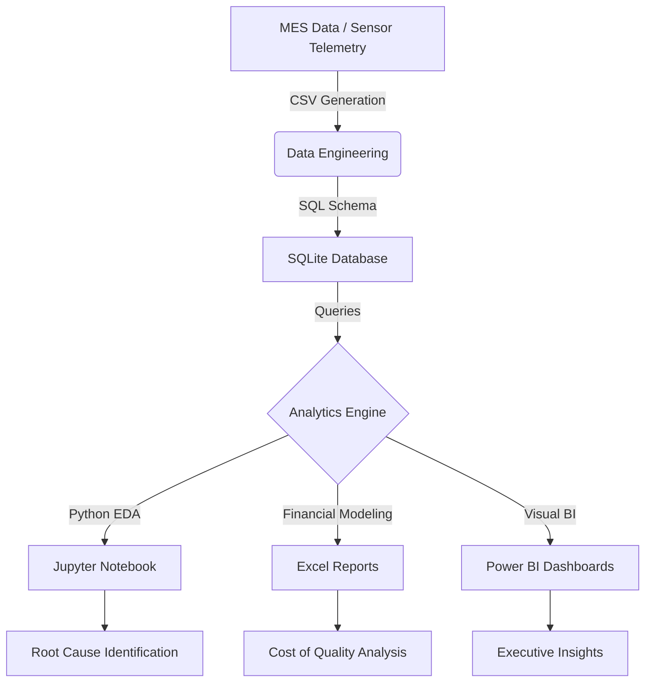

# Semiconductor Fabrication Yield & Sensor Optimization Analysis

## 📌 Project Overview
This project simulates a real-world semiconductor manufacturing analytics environment. It focuses on identifying root causes for **Post-Etch defect rates** and **yield loss** in a 90nm fabrication process.

By analyzing Manufacturing Execution System (MES) data and equipment sensor telemetry, this project identifies which fabrication machines and process parameters (Chamber Pressure, Voltage, Gas Flow) are drifting out of specification and causing wafer failures.

---

## 🛠️ Tech Stack
- **Database:** SQL (SQLite) for production-level data querying.
- **Analytics:** Python (Pandas, NumPy) for data cleaning and statistical analysis.
- **Visualization:** Seaborn, Matplotlib, and Power BI for dashboarding.
- **Financial Modeling:** Microsoft Excel for "Cost of Quality" calculations.

---

## 📂 Project Structure
- `datasets/`: Synthetic semiconductor manufacturing & sensor telemetry data.
- `sql/`: Analytical queries for machine performance and drift detection.
- `notebooks/`: Jupyter Notebook for Exploratory Data Analysis (EDA) and Outlier Removal.
- `excel/`: Corporate-ready "Cost of Quality Analysis" workbook.
- `powerbi/`: Dashboard design guides and mockups.
- `screenshots/`: Visual reports and dashboard previews.

---

## 📊 Key Insights & Results
- **Root Cause Identified:** Machine `MACH_002` showed a 15% higher defect rate correlated with **Chamber Pressure spikes** (>52 psi).
- **Yield Impact:** Every 1% drop in yield results in an estimated **$30,000 monthly loss** in scrap costs.
- **Data Cleaning:** Implemented the **IQR (Interquartile Range) Method** to remove 5% of sensor noise and outliers.

---

## 📝 Resume Bullet Points
- **Built a Semiconductor Analytics Pipeline** using Python and SQL to analyze 5,000+ wafer records, identifying process parameters causing a 5% yield degradation.
- **Designed Interactive Dashboards** in Power BI to visualize machine-level defect trends, sensor drift, and batch-wise performance for manufacturing analysts.
- **Performed Statistical Analysis** (Correlation, IQR Outlier Detection) on sensor telemetry to link Chamber Pressure fluctuations with Gate Oxide Thickness failures.
- **Modeled Financial Impact** of manufacturing defects in Excel, calculating scrap costs and revenue loss per 1% yield drop.

---

## ❓ Interview Q&A
**Q1: Why did you use the IQR method for outlier removal?**
*A: In semiconductor manufacturing, sensors often produce noise or extreme spikes due to calibration resets. IQR is robust to these extreme values and helps us focus on the legitimate process variation that actually affects wafer quality.*

**Q2: How does Chamber Pressure affect Gate Oxide Thickness?**
*A: During the Etch process, pressure regulates the plasma density. If pressure drifts too high, the etch rate increases, leading to a thinner Gate Oxide layer than the target 90nm, which increases the probability of electrical failure.*

**Q3: How would you scale this for 1 million records?**
*A: I would migrate from SQLite to a distributed database like PostgreSQL or Snowflake and use Spark for parallel data processing to handle the high-velocity sensor telemetry.*

---

## 📐 Architecture Diagram

